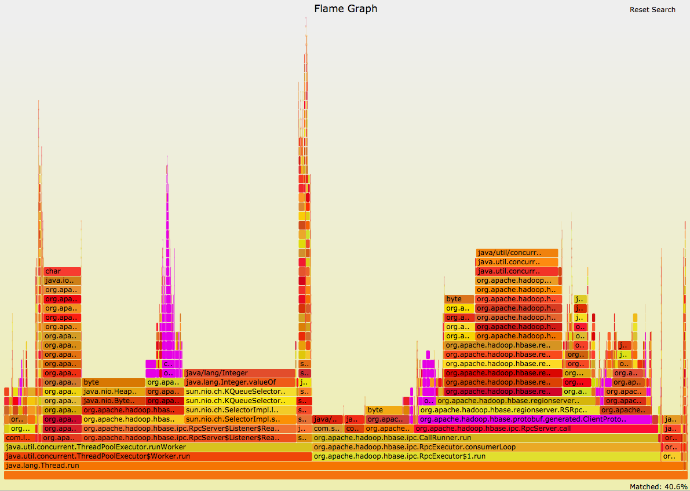
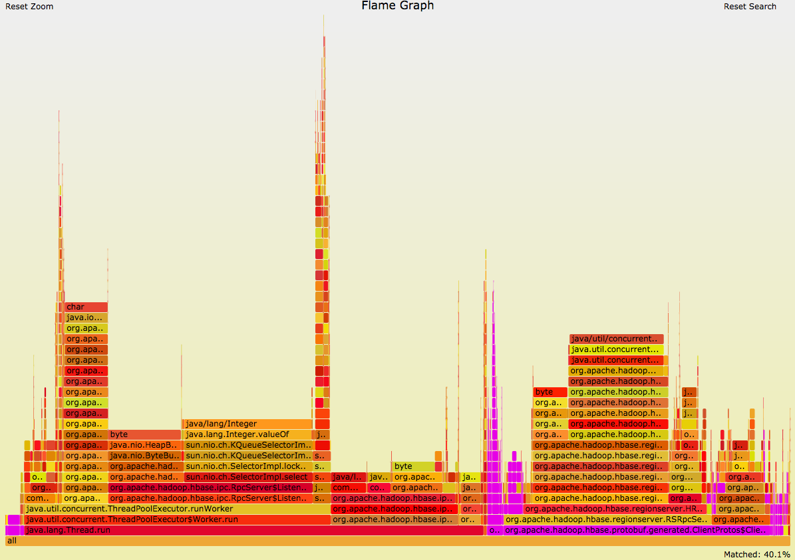

The memory allocation sampler uses a java agent based largely on the [Allocation Instrumentor](https://github.com/google/allocation-instrumenter) library. It outputs memory allocation data which can then be collapsed into a form which can be processed into a flamegraph using the [FlameGraph](https://github.com/brendangregg/FlameGraph) tools.

## Basic usage

### Memory Allocation Tool
When starting the JVM to be instrumented the location of the java agent and the properties file must be provided using the following VM argument.

```
$ java -javaagent:/tmp/java-allocation-instrumenter-3.0-SNAPSHOT.jar=/tmp/flame.properties
```

The sampler will generate an output file (by default stacks.txt) which can be processed using the generate.sh script

```
$ ./generate.sh -i stacks.txt
```

### Remote CPU Flamegraph
This is a CPU profiling tool that generates a `stacks.txt` that can be used to make a CPU flamegraph. The target application will need jmx enabled.

```
$ ./cpuflame.sh <server_address>:<jmx_port>
$ ./generate.sh -i stacks.txt
```


### Histogram Diff Tool
This is a tool designed for diff'ing two `jmap -histo` histograms.

```
$ ./histodiff.sh file1 file2
```

## Package/Class Level Grouping And Filtering

Often there are multiple code paths into a particular package or class and due to the fact that flamegraphs start at the bottom of the stack trace this will cause a particular packages memory allocation to spread all across the flamegraph. You can search the flamegraph with regex's (ctrl-f) and it will highlight the search for you but often this isn't enough.



To remedy this problem the FlameCollapse tool can consolidate all samples that lead to a specific package or class and filter out the rest. To use this simply provide the second parameter (it is NOT case sensitive).

```
$ java -jar target/java-allocation-instrumenter-3.0-SNAPSHOT.jar stacks.txt protobuf

OR

$ ./generate.sh -i stacks.txt -g protobuf
```

This filters out all stack frames prior to entering the specified package or class and all samples that do not pass through the filter. The filtered output can then be used to generate a flamegraph containing a unified summary of data from that package.



## Building

To build from source clone this repository (needs `--recursive` since Flamegraphs is a submodule) and build with maven

```
$ git clone --recursive <clone_link>
$ mvn clean package
```

The agent jar will be built in the `target` directory

```
$ ls -l target
total 248
drwxr-xr-x  16 jmaloney  admin    544 Aug 18 10:07 apidocs
drwxr-xr-x   4 jmaloney  admin    136 Aug 18 10:07 classes
drwxr-xr-x   3 jmaloney  admin    102 Aug 18 10:07 generated-sources
drwxr-xr-x   4 jmaloney  admin    136 Aug 18 10:07 jarjar
-rw-r--r--   1 jmaloney  admin  74471 Aug 18 10:07 java-allocation-instrumenter-3.0-SNAPSHOT-javadoc.jar
-rw-r--r--   1 jmaloney  admin  34017 Aug 18 10:07 java-allocation-instrumenter-3.0-SNAPSHOT-sources.jar
-rw-r--r--   1 jmaloney  admin   9327 Aug 18 10:07 java-allocation-instrumenter-3.0-SNAPSHOT.jar
drwxr-xr-x   4 jmaloney  admin    136 Aug 18 10:07 javadoc-bundle-options
drwxr-xr-x   3 jmaloney  admin    102 Aug 18 10:07 maven-archiver
drwxr-xr-x   3 jmaloney  admin    102 Aug 18 10:07 maven-status
drwxr-xr-x   3 jmaloney  admin    102 Aug 18 10:07 original-classes
```

The `java-allocation-instrumenter-3.0-SNAPSHOT.jar` file is the jar to specify in the javaagent parameter and the jar that contains the FlameCollapse utility.

## Properties

The sampler itself has the following properties that can be passed into the agent.

Property Name | Values | Description
--- | --- | ---
output.file | filepath | Where to output the sampling data.
stack.trace.verbosity | methodName/methodClassName/ methodClassLineNumber | How much detail about each stack frame in the sample is printed.
variable.width | integer | in order to sample (ThreadLocalRandom.current().nextInt() < Integer.MIN_VALUE + variableWidth) must be true
 
## Caveats
 
This doesn't account for escape analysis but shouldn't effect it too much as it doesn't do anything with the allocated objects.